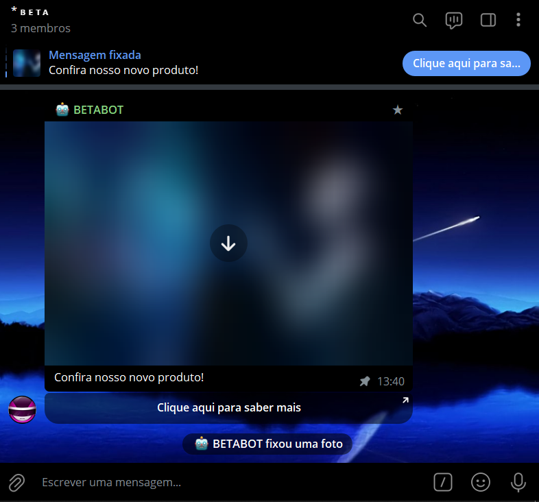
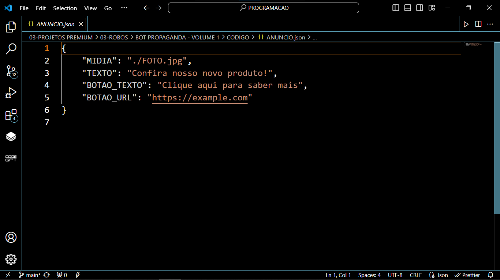
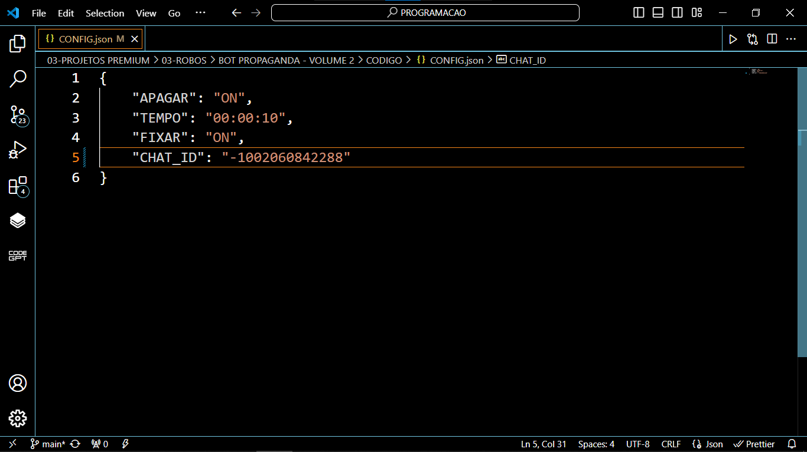

# BOT PROPAGANDA - VOLUME 2
🛑ESSE É UM BOT DO TELEGRAM QUE ENVIA UM ÁNUCIO DE TEMPOS EM TEMPOS!

 <br>
 <br>
 <br>

## DESCRIÇÃO:
Este bot é um bot de anúncios automatizado para grupos do Telegram. Ele é capaz de enviar anúncios periodicamente de acordo com as configurações definidas no arquivo "CONFIG.json". 

O bot utiliza dois arquivos JSON para suas configurações: "CONFIG.json" e "ANUNCIO.json". No arquivo "CONFIG.json", o administrador do grupo pode configurar opções como se deseja apagar o anúncio anterior antes de enviar um novo, o intervalo de tempo entre os anúncios, se o anúncio deve ser fixado no topo do grupo e o ID do grupo para enviar os anúncios. No arquivo "ANUNCIO.json", o administrador pode definir o conteúdo do anúncio, incluindo texto, mídia (foto) e botão de ação com texto e URL.

## PROCEDIMENTO DE COMPRA:
- O valor deste bot é de R$ 900,00.
- Para efetuar a compra, por favor, entre em contato comigo por mensagem privada, informando:
    ```bash
    Gostaria de adquirir o bot: https://github.com/VILHALVA/BOT-PROPAGANDA-VOLUME-2
    ```
- Após a confirmação do pagamento e o envio do comprovante, você receberá um arquivo zip contendo o código-fonte do bot, acompanhado de um manual detalhado (`MANUAL.md`), que oferece instruções abrangentes sobre a configuração do ambiente, sugestões de cursos e documentação recomendada, bem como o arquivo `HOSPEDAGEM.md`, contendo orientações para hospedar o seu bot.
- Caso deseje serviços adicionais, como configuração do bot ou teste VIP, será aplicada uma taxa adicional de R$ 100,00 ao custo do bot.
- Se optar por adicionar mais recursos ou funcionalidades ao projeto, será aplicada uma taxa adicional de R$ 200,00 para cada novo recurso ou funcionalidade.
- [🤑CLIQUE AQUI PARA ENTRAR EM CONTATO](https://t.me/VILHALVA100)
- [🧑‍💻PRECISA DE UM FREELANCER? CLIQUE AQUI PARA VER EM TELEGRAPH](https://telegra.ph/FREELANCER-10-19-9)
- [🧑‍💻PRECISA DE UM FREELANCER? CLIQUE AQUI PARA VER EM README](https://github.com/VILHALVA/VILHALVA/blob/main/FREELANCER/README.md)
